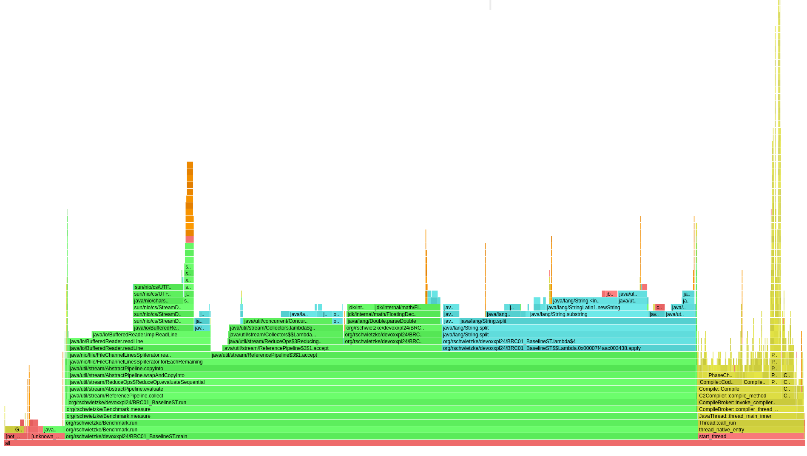
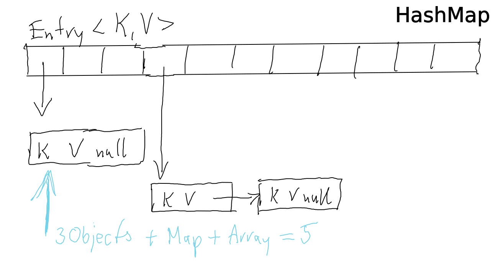
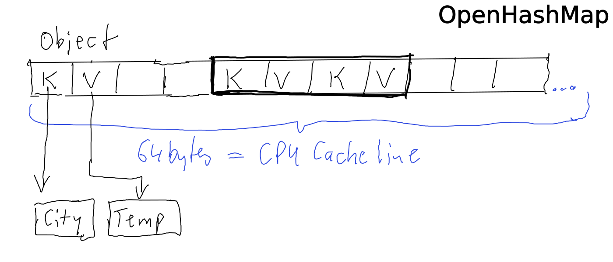

= #1BRC - The First 80% of the Way
René Schwietzke
:jbake-date: 2026-10-11
:jbake-last_updated: 2026-10-11
:jbake-type: post
:jbake-status: published
:jbake-tags: Java, performance, 1BRC, tuning
:subheadline: How to Read One Billion Rows Fast Enough.
:pinned: false
:showfull: false
:idprefix: 1brc-the-first-80p

The https://www.morling.dev/blog/one-billion-row-challenge/[One Billion Row Challenge (1BRC)] started as a way to kill time during the 2023/2024 holidays, asking a simple question: How fast can Java crunch temperature values from a text file and calculate the min, mean, and max per weather station? The catch is the file has one billion rows, totaling at about 13.8 GB.

The top result came from Thomas Wuerthinger, Quan Anh Mai, and Alfonso Peterssen in 1.5 seconds on 8 cores. That was insanely and unexpectedly fast. But when you take a closer look at the code, you will see that it is beyond your daily dose of Java. It is complex, single-use-case oriented, skips safety features, and most of the tunings applied cannot be easily reused. 

This article will show you how to get 80% of the result with simpler and more maintainable code. It will also focus on a single-threaded approach to keep us focused. You can use most of the ideas in your own code easily if you need such tuning. But yes, we will also make decisions that a clean code coach would consider big no-nos.

== The Original Challenge
At the end of 2023, when everyone was busy with the holidays, https://www.morling.dev/[Gunnar Morling] got bored. So he came up with a fun little project to read one billion rows from a CSV file as fast as possible. Recognizing that performance challenges are best tackled by the community, he turned it into a competition. He wanted to see how fast Java code could become with the help of other Java nerds.footnote:[https://www.morling.dev/blog/one-billion-row-challenge/[The One Billion Row Challenge]]

=== The Task
Imagine a data file with one billion rows, each row containing the name of a weather station aka city and a temperature value. The goal is to calculate the min, mean, and max temperature per weather station as fast as possible.

[source]
----
Zagreb;19.7
Tromsø;-3.9
Gangtok;-1.7
Houston;32.4
Zürich;13.8
----

The final output was supposed to look like this. Out of pure laziness, Gunnar went with `TreeMap::toString`. All numbers are properly rounded and formatted to one decimal place.

[source]
----
# This is TreeMap::toString
# Data shown here is formatted for screen
{
   Abha=5.0/18.0/27.4, Abidjan=15.7/26.0/34.1,
   Abéché=12.1/29.4/35.6, Accra=14.7/26.4/33.1,
   Addis Ababa=2.1/16.0/24.3, Adelaide=4.1/17.3/29.7,
   ...
   Willemstad=-7.9,28.2,57.7, Winnipeg=-28.1,3.0,39.4,
   Wrocław=-27.5,9.6,50.2, Xi'an=-22.5,14.0,49.1,
   Yakutsk=-42.2,-8.8,26.4, Yangon=-2.6,27.6,59.0,
   Yaoundé=-10.1,23.6,58.3, Yellowknife=-38.4,-4.0,40.0,
   Yerevan=-18.4,12.4,49.6, Yinchuan=-25.4,9.5,42.0,
   Zagreb=-25.3,10.6,48.4, Zanzibar City=-5.0,26.1,61.2,
   Zürich=-20.9,9.4,43.5, Ürümqi=-26.8,7.4,43.7,
   İzmir=-15.8,18.0,50.1
}
----

Several things are important to note.

* The file is encoded in UTF-8 and contains characters outside the ASCII range.
* The file is fully valid. No BOM, no invalid characters, no trailing spaces, no empty lines.
* We can have up to 10,000 stations but the base version of the file has only 413.
* All line endings are \n.
* All temperatures are within the -99.9 to 99.9 range. Always formatted with one decimal place.
* No station is more than 100 bytes long.

For the competition itself, one could use up to 8-cores. The file was in the file cache because the measurement was done five times and the best three were averaged. But this is not important for our 80% journey.

The following results have been achieved. Once again, these are my measurements and not the official results. Also, as a reminder, we will avoid multi-threading for now to keep things as simple as possible. The baseline, suggested by Gunnar Morling, is straightforward Java code that does the job.

.The Remeasured 1BRC Results
[width=75%,cols="2,>1,>1,>1", options="header"]
|===
|Test |Cores a|Time +
DO Intelfootnote:[Digital Ocean, Amsterdam, Dedicated Machine, Intel CPU-optimized, 16 core, 32 GB, Jan 2025
] a|Time +
Hetzner AMDfootnote:[Hetzner, Finland, Dedicated Machine, AMD, 8 core, 32 GB, Jan 2025]
|Baseline|1|247.6 s |152.1 s
|Baseline|8|111.3 s |81.4 s
|Thomas Wuerthinger|1|8.9 s |7.3 s
|Thomas Wuerthinger|8|1.2 s |1.6 s
|Today's 20% Goal|1|49.5 s |30.4 s
|===

You can already see where we want to go today: our 80% goal or, rather, our 80% tuning. Certainly, this is not a record-breaking number, but most of the tuning and profiling can be applied to your daily work.

TIP: You might not want to brute-force apply the tunings from here to your code. You have to have a problem first. Just because you can, doesn't mean you should. Clean and maintainable code always comes first.

CAUTION: All runtime numbers have been measured by me on 8-core cloud machines at Hetzner (AMD CPUs) and Digital Ocean (Intel CPUs). This means your mileage might vary, and because machines and setups change, I will likely not be able to reproduce the exact numbers when I would run that today. You always have to measure the entire series to get a good picture of the runtimes.

When you look at the winning solution, you can see that it uses `Unsafe`, GraalVM native builds, a ton of bit magic, and many other things that you wouldn't use in your everyday code. Impressive and interesting, but with limited practical reuse. GraalVM native images excluded.

If you want to dive into the final solution, try to understand the https://questdb.com/blog/1brc-merykittys-magic-swar/[branch-less parsing] (also known as SWAR - SIMD Within A Register) because it is the key driver for performance compared to other solutions as well as ours today.

== Our 80% Goal
We don't want to be as fast as the winning solution (which is about 9 seconds for a single thread, more later), we just want to end up with a fifth of the runtime. So we want to shave off 80% of the runtime. 

You can find all the code at https://github.com/rschwietzke/1brc-the-first-80-meters. I will either link to the implementation or just mention the class by name.

Just to detour quickly. The original 1BRC uses single Java files and always runs them several times. To make measurements easier and also allow for better learning in regards to Java JIT compilation, I wrote a https://github.com/rschwietzke/1brc-the-first-80-meters/blob/main/src/main/java/org/rschwietzke/Benchmark.java[small framework] for executing each solution including measurement, warming, and checksumming, not to forget batch execution.

== Step 0: The Baseline
The baseline is the original solution by Gunnar Morling. As you will see, we have a plain stream implementation that uses features Java provides, such as collecting and grouping. I leave the interpretation to you or just read about that in all of the other 1BRC articles out there.

NOTE: This and any following code has been modified to fit the article. Please always refer to the repository for the full code. Formatting is likely inconsistent too.

[source,java]
----
Collector<Measurement, MeasurementAggregator, ResultRow> collector = 
        Collector.of(MeasurementAggregator::new,
        (agg, m) -> {
            agg.min = Math.min(agg.min, m.value);
            agg.max = Math.max(agg.max, m.value);
            agg.sum += m.value;
            agg.count++;
        }, (agg1, agg2) -> {
            var res = new MeasurementAggregator();
            res.min = Math.min(agg1.min, agg2.min);
            res.max = Math.max(agg1.max, agg2.max);
            res.sum = agg1.sum + agg2.sum;
            res.count = agg1.count + agg2.count;

            return res;
        }, agg -> {
            return new ResultRow(agg.min, (Math.round(agg.sum * 10.0) / 10.0) / agg.count, agg.max);
        });

// Measurement is a record
// MeasurementAggregator is a regular data class
// ResultRow is a class that can print to the proper output format
var result = Files.lines(Paths.get(fileName))
        .map(l -> l.split(";"))
        .map(l -> new Measurement(l))
        .collect(groupingBy(m -> m.station(), collector));

return new TreeMap<>(result).toString();
----

== Step 1: Get to Know the Code
The above code runs for a moment, but we don't know yet where it might spend most of its time. We don't want to guess what to optimize; we want to see. For that, we look into our toolbox and find the https://github.com/async-profiler/async-profiler[AsyncProfiler] – perhaps the most versatile and powerful open-source profiler for Java. 

With this command line, you can create this flamegraph and browse it yourself.

[source,bash]
----
java \
    -agentpath:libasyncProfiler.so=start,event=cpu,flamegraph,file=flamegraph.html \
    -cp target/classes/ \
    org.rschwietzke.devoxxpl24.BRC01_BaselineST measurements.txt 2 2
----

.A flamegraph of the baseline solution

That is the last flamegraph we will see in this article. You can browse a lot more when you page through the https://training.xceptance.com/java/451-the-first-80p-of-1BRC-jfokus-2025.html[Jfokus 2025 slides]. For the rest of the article, we will go with a small table that shows us the most important parts and the percentage of time spent there.

.BRC01_BaselineST
[width=50%,cols="2,>1",options="header"]
|===
|Method|%
|`run`|78.4 %
|`readLine`|17.7 %
|`split`|31.7 %
|`parseDouble`|11.7 %
|`store/reduce`|14.4 %
|===

About 80% of the total runtime goes into our own code, and `split` dominates that. Let's start there. However, stream code is hard to tune because a lot of things are just magic done by the JDK and are not visible to us.

[source,java]
----
final Map<String, Temperatures> cities = new HashMap<>();

try (var reader = Files.newBufferedReader(Paths.get(fileName)))
{
    String line;
    while ((line = reader.readLine()) != null)
    {
        // split the line
        final String[] cols = line.split(";");

        // get us the data to store
        final String city = cols[0];
        final double temperature = Double.parseDouble(cols[1]);

        // store and sum up the data
        // Map::merge(key, value, remappingFunction)
        cities.merge(city, new Temperatures(temperature), (t1, t2) -> t1.merge(t2));
    }
}

// ok, we got everything, now we need to order it
return new TreeMap<String, Temperatures>(cities).toString();
----

Our classic approach is just an unrolled stream operation and the `collect` and `groupBy` is done manually. Let's look at the flamegraph data. DO is our DigitalOcean Intel Server and HE is our AMD 8-core at Hetzner.

.Runtimes BRC03_NoStreamST
[width=75%,cols="2,>1,>1,>1,>1",options="header"]
|===
|Code|Time DO|%|Time HE|%
|`BRC01_BaselineST`|247.6 s |100.0%|152.0 s |100.0%
|`BRC03_NoStreamST`|232.1 s |93.7%|138.9 s |91.4%
|80% Goal|49.5 s |20.0%|30.4 s |20.0%
|===

So, we gained speed by getting rid of the stream code. That was easy. 

IMPORTANT: This does not mean you should abandon streams. Streams are a powerful tool and should be used when appropriate. They might not be perfect for performance-critical code, but they are great for everyday code.

.Profiling Data BRC03_NoStreamST
[width=75%,cols="2,>1,>1",options="header"]
|===
|Method|01|03
|`run`|78.4 %|80.4 %
|`readLine`|17.7 %|17.9 %
|`split`|31.7 %|26.8 %
|`parseDouble`|11.7 %|12.2 %
|`store/reduce`|14.4 %|21.0 %
|===

Things moved a little, but the overall distribution is nearly the same. Our manual merge is slower and we will learn later why, and then use that knowledge to fix it.

== Step 2: Split
Split consumes the majority of our time, so let's get rid of that first. Split is a very powerful method that normally uses regular expressions to split a string. When you look at the https://github.com/openjdk/jdk21u-dev/blob/248eb5468f3c7ba5f338c09af35048ac22ca8e86/src/java.base/share/classes/java/lang/String.java#L3320[JDK code of split], you can see that it tries to be smart. It features a fastpath when the split char is a single char and not a regex. The JIT (Just-In-Time) compiler might or might not be able to "constant fold" it (calculating the value once and reusing it). Even when this is folded, it still leaves us with a call to a larger method that creates objects and might not be https://www.baeldung.com/jvm-method-inlining[inlined] (where the compiler copies the method's code into the caller to avoid the overhead of a method jump). 

[source,java]
----
// our cities with temperatures
final Map<String, Temperatures> cities = new HashMap<>();

try (var reader = Files.newBufferedReader(Paths.get(fileName)))
{
    String line;
    while ((line = reader.readLine()) != null)
    {
        // split the line
        final int pos = line.indexOf(';'); // <--

        // get us the city
        final String city = line.substring(0, pos); // <--
        final String temperatureAsString = line.substring(pos + 1); // <--

        // parse our temperature
        final double temperature = Double.parseDouble(temperatureAsString);

        // merge the data into the captured data
        cities.merge(city, new Temperatures(temperature), (t1, t2) -> t1.merge(t2));
    }
}

// ok, we got everything, now we need to order it and print it
return new TreeMap<String, Temperatures>(cities).toString();
----

.BRC05_ReplaceSplitST
[width=75%,cols="2,>1,>1,>1,>1",options="header"]
|===
|Code|Time DO|%|Time HE|%
|`BRC01_BaselineST`|247.6 s |100.0%|152.0 s |100.0%
|`BRC03_NoStreamST`|232.1 s |93.7%|138.9 s |91.4%
|`BRC05_ReplaceSplitST`|175.9 s |71.0%|109.7 s |72.2%
|===

That is impressive. Almost no effort and we gained more than 20%. It is interesting to see that AMD and Intel are not getting the same speedup. We will see that pattern again and again.

NOTE: No, you should not replace all `String::split` in your codebase. Most code is not performance-critical and might be more readable with `split`, possibly even less error-prone.

IMPORTANT: If it runs faster on your machine, don't assume you will see the same on your production server or on another machine of a different type or architecture. Always measure and profile where you really need the speedup. 

.Profiling Data BRC05_ReplaceSplitST
[width=75%,cols="2,>1,>1,>1",options="header"]
|===
|Area|01|03|05
|Total|78.4 %|80.4 %|81.3 %
|`readLine`|17.7 %|17.9 %|31.6 %
|`split`|31.7 %|26.8 %|n/a
|`indexOf`|n/a|n/a|2.2 %
|`subString`|n/a|9.2 %|7.6 %
|`parseDouble`|11.7 %|12.2 %|14.8 %
|`merge`|14.4 %|21.0 %|23.9 %
|===

Our `split` disappeared into `indexOf` and `substring`.

== Step 3: Double Parsing

When you check the `Double::parseDouble` code in the JDK, you find code that is more than 200 lines long and covers almost all possible edge cases. But we don't have edge cases here. We know that our input is always a valid double with one decimal place, so let's use that knowledge to our advantage.

[source,java]
----
public static double parseDouble(final String s) {
    return parseDouble(s, 0, s.length() - 1);
}

private static final double[] multipliers = {
    1, 1, 0.1, 0.01, 0.001, 0.000_1, 0.000_01, 0.000_001, 0.000_000_1, 0.000_000_01,
    0.000_000_001, 0.000_000_000_1, 0.000_000_000_01, 0.000_000_000_001, 0.000_000_000_000_1,
    0.000_000_000_000_01, 0.000_000_000_000_001, 0.000_000_000_000_000_1, 0.000_000_000_000_000_01};

public static double parseDouble(final String s, final int offset, final int end) {
    final int negative = s.charAt(offset) == '-' ? offset + 1 : offset;

    long value = 0;
    int decimalPos = end;

    for (int i = negative; i <= end; i++) {
        final int d = s.charAt(i);
        if (d == '.') {
            decimalPos = i;
            continue;
        }
        final int v = d - DIGITOFFSET;
        value = ((value << 3) + (value << 1));
        value += v;
    }

    // adjust the decimal places
    value = negative != offset ? -value : value;
    return value * multipliers[end - decimalPos + 1];
}
----

I had some code available that I used in another project, so I used that here. The code is already prepared to cover the next steps as well. 

CAUTION: This code is not 100% correct due to the inherent imprecision of floating-point calculations on CPUs (see https://en.wikipedia.org/wiki/IEEE_754[IEEE 754]), but it works well enough in our case due to the limitation to one decimal place.

.BRC06_NewDoubleParsingST
[width=75%,cols="2,>1,>1,>1,>1",options="header"]
|===
|Code|Time DO|%|Time HE|%
|`BRC01_BaselineST`|247.6 s |100.0%|152.0 s |100.0%
|`BRC03_NoStreamST`|232.1 s |93.7%|138.9 s |91.4%
|`BRC05_ReplaceSplitST`|175.9 s |71.0%|109.7 s |72.2%
|`BRC06_NewDoubleParsingST`|141.2 s |57.0%|99.0 s |65.2%
|===

We gained a lot on the Intel CPU. For the AMD CPU, we got it 10 seconds faster.

.Profiling Data BRC06_NewDoubleParsingST
[width=75%,cols="2,>1,>1,>1,>1",options="header"]
|===
|Area|01|03|05|06
|Total|78.4 %|80.4 %|81.3 %|76.2 %
|`readLine`|17.7 %|17.9 %|31.6 %|32.8 %
|`split`|31.7 %|26.8 %|n/a|n/a
|`indexOf`|n/a|n/a|2.2 %|2.2 %
|`subString`|n/a|9.2 %|7.6 %|9.9 %
|`parseDouble`|11.7 %|12.2 %|14.8 %|4.4 %
|`merge`|14.4 %|21.0 %|23.9 %|25.8 %
|===

== Step 4: One Less String
If you look at our current code, you can easily see that we create a new `String` only to pass it to the `Double::parseDouble` method. Since it’s only being read, we don't actually need that instance at all.

So, let's continue by parsing the double inline, based on the position of the semicolon in the original data set without splitting it for real.

[source,java]
----
while ((line = reader.readLine()) != null)
{
    // split the line
    final int pos = line.indexOf(';');

    // get us the city
    final String city = line.substring(0, pos);
    // OLD: final String temperatureAsString = line.substring(pos + 1);

    // parse our temperature inline without an instance of a string for temperature
    // OLD: final double temperature = Double.parseDouble(temperatureAsString);
    final double temperature = ParseDouble.parseDouble(line, pos + 1, line.length() - 1);

    // merge the data into the captured data
    cities.merge(city, new Temperatures(temperature), (t1, t2) -> t1.merge(t2));
}
----

.BRC07_NoCopyForDoubleST
[width=75%,cols="2,>1,>1,>1,>1",options="header"]
|===
|Code|Time DO|%|Time HE|%
|`BRC01_BaselineST`|247.6 s |100.0%|152.0 s |100.0%
|`BRC03_NoStreamST`|232.1 s |93.7%|138.9 s |91.4%
|`BRC05_ReplaceSplitST`|175.9 s |71.0%|109.7 s |72.2%
|`BRC06_NewDoubleParsingST`|141.2 s |57.0%|99.0 s |65.2%
|`BRC07_NoCopyForDoubleST`|127.7 s |51.6%|88.0 s |57.9%
|===

That was simple and very effective.

.Profiling Data BRC07_NoCopyForDoubleST
[width=75%,cols="2,>1,>1,>1,>1,>1",options="header"]
|===
|Area|01|03|05|06|07
|Total|78.4 %|80.4 %|81.3 %|76.2 %|76.4 %
|`readLine`|17.7 %|17.9 %|31.6 %|32.8 %|29.6 %
|`split`|31.7 %|26.8 %|n/a|n/a|n/a
|`indexOf`|n/a|n/a|2.2 %|2.2 %|2.6 %
|`subString`|n/a|9.2 %|7.6 %|9.9 %|5.8 %
|`parseDouble`|11.7 %|12.2 %|14.8 %|4.4 %|6.0 %
|`merge`|14.4 %|21.0 %|23.9 %|25.8 %|28.7 %
|===

== Step 5: Double is Double the Work
In case you have worked with old computers before, something like 486 or even the first Pentiums, you know that `double` is extra work and slower than `int`. We also know that our double here is something like XX.X, so we can easily deal with all numbers as int and only fix that up at the end when we print out the data. 

[source,java]
----
/**
 * Parses a double but ends up with an int, only because we know
 * the format of the results -99.9 to 99.9
 */
public static int parseInteger(final String s, final int offset, final int end)
{
    final int negative = s.charAt(offset) == '-' ? offset + 1 : offset;

    int value = 0;

    for (int i = negative; i <= end; i++)
    {
        final int d = s.charAt(i);
        if (d == '.')
        {
            continue;
        }
        final int v = d - DIGITOFFSET;
        // multiply by 10 = multiply by 8 + multiply by 2
        value = ((value << 3) + (value << 1));
        value += v;
    }

    value = negative != offset ? -value : value;
    return value;
}
----
Our new `double` parsing is actually only `int` parsing now and we silently drop the decimal information. Essentially, we postpone working with doubles until we print the result data.

.BRC08_GoIntST
[width=75%,cols="2,>1,>1,>1,>1",options="header"]
|===
|Code|Time DO|%|Time HE|%
|`BRC01_BaselineST`|247.6 s |100.0%|152.0 s |100.0%
|`BRC03_NoStreamST`|232.1 s |93.7%|138.9 s |91.4%
|`BRC05_ReplaceSplitST`|175.9 s |71.0%|109.7 s |72.2%
|`BRC06_NewDoubleParsingST`|141.2 s |57.0%|99.0 s |65.2%
|`BRC07_NoCopyForDoubleST`|127.7 s |51.6%|88.0 s |57.9%
|`BRC08_GoIntST`|124.0 s |50.1%|87.3 s |57.4%
|===

We did not gain that much—just a little bit. You have to keep one thing in mind: a modern CPU still has more execution units for integer operations than for double-precision operations. Modern CPUs run instructions in parallel, so we're enabling them to utilize more execution units where possible. Do we really profit from that? It’s hard to tell.

When we look at our flamegraph data, we can also not really draw any conclusions. A modern CPU does not execute one command at a time, but many. If they cannot do that, they become slow.

.Profiling Data BRC08_GoIntST
[width=75%,cols="2,>1,>1,>1,>1,>1,>1",options="header"]
|===
|Area|01|03|05|06|07|08
|Total|78.4 %|80.4 %|81.3 %|76.2 %|76.4 %|79.3 %
|`readLine`|17.7 %|17.9 %|31.6 %|32.8 %|29.6 %|34.4 %
|`split`|31.7 %|26.8 %|n/a|n/a|n/a|n/a
|`indexOf`|n/a|n/a|2.2 %|2.2 %|2.6 %|2.5 %
|`subString`|n/a|9.2 %|7.6 %|9.9 %|5.8 %|6.0 %
|`parseDouble`|11.7 %|12.2 %|14.8 %|4.4 %|6.0 %|8.2 %
|`merge`|14.4 %|21.0 %|23.9 %|25.8 %|28.7 %|24.2 %
|===

== Step 6: Look, No Lambda
At the moment, we utilize a lambda expression to merge the data. Because we plan some more optimizations later, we might have to change that. 

[source,java]
----
while ((line = reader.readLine()) != null)
{
    // split the line
    final int pos = line.indexOf(';');

    // get us the city
    final String city = line.substring(0, pos);

    // parse our temperature inline without an instance of a string for temperature
    final int temperature = ParseDouble.parseInteger(line, pos + 1, line.length() - 1);

    // get city and update
    // OLD: cities.merge(city, new Temperatures(temperature), (t1, t2) -> t1.merge(t2));
    final var v = cities.get(city);
    final var t = new Temperatures(temperature);
    cities.put(city, v != null ? v.merge(t) : t);
}
----

.BRC09_NoMergeST
[width=75%,cols="2,>1,>1,>1,>1",options="header"]
|===
|Code|Time DO|%|Time HE|%
|`BRC01_BaselineST`|247.6 s |100.0%|152.0 s |100.0%
|`BRC03_NoStreamST`|232.1 s |93.7%|138.9 s |91.4%
|`BRC05_ReplaceSplitST`|175.9 s |71.0%|109.7 s |72.2%
|`BRC06_NewDoubleParsingST`|141.2 s |57.0%|99.0 s |65.2%
|`BRC07_NoCopyForDoubleST`|127.7 s |51.6%|88.0 s |57.9%
|`BRC08_GoIntST`|124.0 s |50.1%|87.3 s |57.4%
|`BRC09_NoMergeST`|131.1 s |53.0%|95.4 s |62.7%
|===

Wow, that is unexpected. We are slower now. But why? This is not obvious but easily explained. 

When we `get` our data, we need the hashCode first and we retrieve the data from the calculated position. If the data is not there, we return null. For the later `put`, we do the same again. Our lambda expression was able to combine that; hence it was only one method call, and it only needed to calculate the hashCode once and access the backing datastructure once. But we will get there again, promised.

== Step 7: The Modern Anti Pattern: Mutability
Before we try to restore the original speed again, we should look at our code and see if there is something more obvious we can tackle.

Our code, even though I have not shown that here, still uses immutable classes for storing the temperature data. That is a modern practice and perfect for concurrent code because it makes things less error-prone, but it is a silent performance killer. Nothing is free: not memory, not CPU cycles, and not memory bandwidth. Every time you create a new instance to update a value, the JVM must allocate memory and later clean it up via Garbage Collection. So, let's mutate the `Temperature` instead.

[source,java]
----
while ((line = reader.readLine()) != null)
{
    ...
    // get city
    final Temperatures v = cities.get(city);
    if (v != null)
    {
        // know it, put both together
        v.add(temperature);
    }
    else
    {
        // we have not seen that city yet, create a container and store it
        cities.put(city, new Temperatures(temperature));
    }
}
----

We only create a new `Temperatures` instance if we have not seen the city before. If we have seen the city before, we just add the temperature to the existing instance.

.BRC10_MutateST
[width=75%,cols="2,>1,>1,>1,>1",options="header"]
|===
|Code|Time DO|%|Time HE|%
|`BRC01_BaselineST`|247.6 s |100.0%|152.0 s |100.0%
|`BRC03_NoStreamST`|232.1 s |93.7%|138.9 s |91.4%
|`BRC05_ReplaceSplitST`|175.9 s |71.0%|109.7 s |72.2%
|`BRC06_NewDoubleParsingST`|141.2 s |57.0%|99.0 s |65.2%
|`BRC07_NoCopyForDoubleST`|127.7 s |51.6%|88.0 s |57.9%
|`BRC08_GoIntST`|124.0 s |50.1%|87.3 s |57.4%
|`BRC09_NoMergeST`|131.1 s |53.0%|95.4 s |62.7%
|`BRC10_MutateST`|109.8 s |44.4%|84.9 s |53.9%
|===

That helped a lot. Let's take a look at the current state of our code. I took the liberty of removing some of the data we have seen before to keep things compact.

.Profiling Data BRC10_MutateST
[width=75%,cols="2,>1,>1,>1,>1,>1",options="header"]
|===
|Area           |01     |07     |08     |09     |10
|Total          |78.4 % |76.4 % |79.3 % |80.3 % |79.3 %
|`readLine`     |17.7 % |29.6 % |34.4 % |39.1 % |34.4 %
|`split`        |31.7 % |n/a    |n/a    |n/a    |n/a
|`indexOf`      |n/a    |2.6 %  |2.5 %  |2.8 %  |2.5 %
|`substring`    |n/a    |9.2 %  |6.0 %  |7.9 %  |6.2 %
|`parseDouble`  |11.7 % |6.0 %  |8.2 %  |6.3 %  |6.6 %
|`get`          |14.4 % |28.7 % |24.2 % |10.9 % |15.7 %
|`merge`        |14.4 % |28.7 % |24.2 % |2.3 %  |0.0 %
|`put`          |14.4 % |28.7 % |24.2 % |5.2 %  |0.0 %
|===

Mutating data removes the `merge` and makes the `put` very rare, so we don't even see that in our profiling data anymore. The `get` is not slower, it just sees more share of the overall runtime. Also our `add` is so fast and likely inlined that we cannot see it in the flamegraph.

== Step 8: A Simpler Map
When we removed the lambda expression, we got slower. So, let's address that now. We use the default `HashMap` from the JDK, and that is a good and very versatile implementation. But we don't need that versatility here. We also know, when looking at our profiling data, that there is something like `getNode` visible. If you check the `HashMap`, you will see that it stores key and value in a wrapper object, the node. We can do better.

.A Basic Map Implementation

Our map has backing arrays with wrapper objects that hold key and value. In addition, in case of collisions, we build a linked list with the wrapper objects.

A simplified `Map` implementation might look like that.

.A Simple Open Hashing Map

Our open map uses a backing array as well but stores key and value next to each other. Yes, this is less perfect in terms of code beauty. When we have collisions, we store the other data simply in the next position in the array. I used https://github.com/mikvor/hashmapTest/blob/master/src/main/java/map/objobj/ObjObjMap.java[ObjObjMap] as the starting point.

.BRC12_NewMapST
[width=75%,cols="2,>1,>1,>1,>1",options="header"]
|===
|Code|Time DO|%|Time HE|%
|`BRC01_BaselineST`|247.6 s |100.0%|152.0 s |100.0%
|`BRC03_NoStreamST`|232.1 s |93.7%|138.9 s |91.4%
|`BRC05_ReplaceSplitST`|175.9 s |71.0%|109.7 s |72.2%
|`BRC06_NewDoubleParsingST`|141.2 s |57.0%|99.0 s |65.2%
|`BRC07_NoCopyForDoubleST`|127.7 s |51.6%|88.0 s |57.9%
|`BRC08_GoIntST`|124.0 s |50.1%|87.3 s |57.4%
|`BRC09_NoMergeST`|131.1 s |53.0%|95.4 s |62.7%
|`BRC10_MutateST`|109.8 s |44.4%|84.9 s |53.9%
|`BRC12_NewMapST`|109.6 s |44.3%|80.2 s |52.9%
|===

So, some gain for AMD CPUs, but not much for Intel.

== Step 9: Turn the Map Into a Set
Our current map has a drawback. It needs two slots and it needs a wrapper for the values. Why not combine that into a single entry? And so we get a set.

.A Simple Open Hashing Set

We can fit twice as many object references into a CPU cache line (a small, ultra-fast memory area inside the processor). Because we have already our wrapper in our hands, we don't need to look up a second object either, which reduces memory access and speeds things up.

As part of this change, we also will remove the need for a separate put method and return to the concept we abandoned when removing the lambda expression. Call the method once and let it decide if this is a new entry or just an update. In addition, we also move the `Temperatures` handling into the `Set` class. Yes, I know: reuse, architecture, clean code, and so on. Sometimes you have to trade a bit of elegance for performance. It is no longer a generic `Set`, but we're giving everything for performance, aren't we?

[source,java]
----
private Temperatures[] m_data;

public void getPutOrUpdate( final String city, int value ) {
    final int hash = city.hashCode();
    int ptr = hash & m_mask;
    Temperatures k = m_data[ ptr ];

    if ( k == FREE_KEY ) {
        put(new Temperatures(city, value));
        return;
    }

    if ( k.equals( city ) ) {
        k.add(value);
        return;
    }

    while ( true ) {
        ptr = (ptr + 1) & m_mask; //that's next index
        k = m_data[ ptr ];
        if ( k == FREE_KEY ) {
            put(new Temperatures(city, value));
            return;
        }
        if ( k.equals( city ) ) {
            k.add(value);
            return;
        }
    }
}
----

.BRC13_HardcodedSetST
[width=75%,cols="2,>1,>1,>1,>1",options="header"]
|===
|Code|Time DO|%|Time HE|%
|`BRC01_BaselineST`|247.6 s |100.0%|152.0 s |100.0%
|`BRC03_NoStreamST`|232.1 s |93.7%|138.9 s |91.4%
|`BRC05_ReplaceSplitST`|175.9 s |71.0%|109.7 s |72.2%
|`BRC06_NewDoubleParsingST`|141.2 s |57.0%|99.0 s |65.2%
|`BRC07_NoCopyForDoubleST`|127.7 s |51.6%|88.0 s |57.9%
|`BRC08_GoIntST`|124.0 s |50.1%|87.3 s |57.4%
|`BRC09_NoMergeST`|131.1 s |53.0%|95.4 s |62.7%
|`BRC10_MutateST`|109.8 s |44.4%|84.9 s |53.9%
|`BRC12_NewMapST`|109.6 s |44.3%|80.2 s |52.9%
|`BRC13_HardcodedSetST`|105.3 s |42.6%|76.5 s |50.3%
|===

Ok, we gained about 2%. Not much, but we are making progress.

.Profiling Data BRC13_HardcodedSetST
[width=75%,cols="2,>1,>1,>1,>1,>1,>1,>1",options="header"]
|===
|Area           |01     |07     |08     |09     |10     |12     |13    
|Total          |78.4 % |76.4 % |79.3 % |80.3 % |79.3 % |74.1 % |72.1 %
|`readLine`     |17.7 % |29.6 % |34.4 % |39.1 % |34.4 % |37.9 % |38.2 %
|`split`        |31.7 % |n/a    |n/a    |n/a    |n/a    |n/a    |n/a
|`indexOf`      |n/a    |2.6 %  |2.5 %  |2.8 %  |2.5 %  |2.0 %  |3.2 %
|`substring`    |n/a    |9.2 %  |6.0 %  |7.9 %  |6.2 %  |7.7 %  |4.5 %
|`parseDouble`  |11.7 % |6.0 %  |8.2 %  |6.3 %  |6.6 %  |8.3 %  |6.7 %
|`get(OrUpdate)`|14.4 % |28.7 % |24.2 % |10.9 % |15.7 % |15.4 % |16.1 %
|`merge`        |14.4 % |28.7 % |24.2 % |2.3 %  |0.0 %  |0.0 %  |0.0 %
|`put`          |14.4 % |28.7 % |24.2 % |5.2 %  |0.0 %  |0.0 %  |0.0 %
|===

== Step 10: Heavy Lifting - I/O
Okay, we’ve addressed all the "cheap" optimizations. Now what? We have to deal with the I/O side of life. How can we make `readLine` faster? 

Sit back, relax, and let's dive in. Let's have another look at our data and its constraints.

Our data is well-formatted and controlled by definition. Everything is valid UTF-8, and UTF-8 includes ASCII characters. These are the first 127 bytes (not chars). 

Since all our numbers, semicolons, and newlines are ASCII, why bother converting everything to `char` when reading from disk (which stores just bytes)? Instead, let's delay the conversion to `char` until we actually need a char. This is similar to our double-to-int approach: delay repeated actions that aren't necessary for immediate processing.

[source,java]
----
try (var raf = new RandomAccessFile(fileName, "r");
     var channel = raf.getChannel();)
{
    final Line line = new Line(channel);

    while (true)
    {
        // get us a range of bytes marked in our buffer
        line.readFromChannel();

        if (line.hasNewLine)
        {
            // parse our temperature inline without an instance of a string for temperature
            final int temperature = ParseDouble.parseInteger(line.data,
                line.semicolonPos + 1, line.newlinePos - 1);

            // find and update
            cities.getPutOrUpdate(line, temperature);
        }
        if (line.EOF)
        {
            break;
        }
    }
}

private ByteBuffer buffer = ByteBuffer.allocate(MIN_BUFFERSIZE);
private byte[] data = buffer.array();

private void readFromChannel()
{
    hasNewLine = false;

    try 
    {
        // are we nearing the end of the buffer?
        if (end - pos < REMAINING_MIN_BUFFERSIZE)
        {
            // we move the buffer indirectly, because
            // the ByteBuffer just wraps our array,
            // not for the faint of heart
            System.arraycopy(data, pos, data, 0, data.length - pos);
            end = end - pos;
            pos = 0;
            buffer.position(end);

            // fill the buffer up
            final int readBytes = channel.read(buffer);
            if (readBytes == -1) 
            {
                EOF = true;
            }

            end = buffer.position();
        }
    }
    catch (IOException e) 
    {
        ...
    }
    lineStartPos = pos;

    // look for semicolon and new line
    int i = pos;
    for (; i < end; i++)
    {
    	final byte b = data[i];
    	if (b == ';')
    	{
    		semicolonPos = i;
    		break;
    	}
    }

    i++;
    for (; i < end; i++)
    {
        final byte b = data[i];
    	if (b == '\n')
    	{
    		newlinePos = i;
    		pos = i + 1;
    		hasNewLine = true;
    		return;
    	}
    }
}
----

We could use the `ByteBuffer` directly and read bytes from it, but repeatedly calling methods that check the range of the backing array introduces significant overhead. Instead, we will access the backing array directly to gain speed.

.BRC14b_ReadBytesFixed
[width=75%,cols="2,>1,>1,>1,>1",options="header"]
|===
|Code|Time DO|%|Time HE|%
|`BRC01_BaselineST`|247.6 s |100.0%|152.0 s |100.0%
|`BRC03_NoStreamST`|232.1 s |93.7%|138.9 s |91.4%
|`BRC05_ReplaceSplitST`|175.9 s |71.0%|109.7 s |72.2%
|`BRC06_NewDoubleParsingST`|141.2 s |57.0%|99.0 s |65.2%
|`BRC07_NoCopyForDoubleST`|127.7 s |51.6%|88.0 s |57.9%
|`BRC08_GoIntST`|124.0 s |50.1%|87.3 s |57.4%
|`BRC09_NoMergeST`|131.1 s |53.0%|95.4 s |62.7%
|`BRC10_MutateST`|109.8 s |44.4%|84.9 s |53.9%
|`BRC12_NewMapST`|109.6 s |44.3%|80.2 s |52.9%
|`BRC13_HardcodedSetST`|105.3 s |42.6%|76.5 s |50.3%
|`BRC14b_ReadBytesFixed`|57.3 s |23.2%|46.1 s |30.4%
|===

What a leap! Let's check our profiling data. Because the code is so different now, we will limit the profiling to our last two measurements.

.Profiling Data BRC14b_ReadBytesFixed
[width=75%,cols="2,>1,>1",options="header"]
|===
|Area           |13     |14
|Total          |72.1 % |80.2 % 
|`readLine`     |38.2 % |
|`readFromChannel`|     |20.5 %  
|> `self`         |     |18.3 %  
|> `read`         |     |2.2 %  
|`indexOf`      |3.2 %  |
|`substring`    |4.5 %  |
|`parseDouble`   |6.7 %  |8.3 %  
|`putOrUpdate`  |16.1 % |48.6 % 
|> _self_        |2.7 %  |6.5 % 
|> `add`         |0.8 %  |1.1 %  
|> `hashCode`    |5.1 %  |26.6 % 
|> `equals`      |7.5 %  |14.4 % 
|===

Our `readLine` contains a method call to `read` and that is 2.2% of the runtime. The rest is used for our data processing. Yes, it could have been extracted more neatly into its own method. Next time!

== The Unexpected Bonus
When we run our baseline code with EpsilonGC, we get about 3.2 GB of heap usage for 10 million lines. That sums up to a staggering 320 GB for 1 billion rows. That is memory churn at the end of the day. Request memory, clean it, use it, investigate if still in use, add it to the free list or move the content around when still in use. By the way, we are not really allocating and deallocating against the OS here, because the JVM does its own memory segment management (ask for a chunk of memory from the OS and own that as long as possible),

NOTE: EpsilonGC (see https://openjdk.org/jeps/318[JEP 318]) is a GC that does not do any GC at all. It just reserves or assigns memory, but never frees it. Hence, a program might crash after a while if it needs more memory than what the heap can hold. Perfect for tuning and investigations because all background GC processes are offline.

[source,bash]
----
# Run with max heap 4 GB for 10 M lines
java -Xlog:gc*=debug \
     -Xms4g -Xmx4g \
     -XX:+UnlockExperimentalVMOptions \
     -XX:+UseEpsilonGC \
     -cp target/classes/ \
     org.rschwietzke.devoxxpl24.BRC01_BaselineST \
     data-10m.txt 0 1

[3.726s][info][gc] Heap: 4096M reserved, 3204M (78.22%) committed, 3199M (78.11%) used
----

When we repeat that for our version 13, before we changed to byte reading, we see 1.04 GB memory used for 10 million lines. That is a total of 104 GB for 1 billion rows.

[source,bash]
----
# Run with max heap 4 GB for 10 M lines
java ... \
     org.rschwietzke.devoxxpl24.BRC13_HardcodedSetST \
     data-10m.txt 0 1

[2,035s][info][gc] Heap: 4096M reserved, 1129M (27,57%) committed, 1037M (25,33%) used
----

If we repeat that with our version 14 and byte reading, we will consume 3.7 MB for 1 billion rows. You read that right: less than 4 MB for 1 billion rows. 

[source,bash]
----
# Run with max heap 4 MB(!) for 1000 M lines
java ... \
     -Xms4m -Xmx4m \
     org.rschwietzke.devoxxpl24.BRC14_ReadBytesST \
     data-1000m.txt 0 1

[55.401s][info][gc] Heap: 4096K reserved, 4096K (100.0%) committed, 3634K (88.73%) used
----

This is a rather unexpected bonus: we are now effectively GC-less. We are using almost no memory, and the data will likely fit into the CPU cache. One important note: we still transfer 13 GB of data from the file into our program, but because this isn't handled by the heap, it doesn't involve constant allocation and garbage collection. While the CPU cache might see some "pollution" (where reading new data from disk pushes useful data out of the cache), the overall efficiency is massive.

== Step 11: Improve Number Parsing
We’ve made a huge leap, but we’re still not quite at our 80% reduction goal. While we’re very close on the Intel system, the AMD results are lagging slightly behind.

Let’s try some "cheaper" tuning first. Let's revisit our number parsing.

[source,java]
----
/**
 * Parses a double but ends up with an int, only because we know
 * the format of the results -99.9 to 99.9
 */
public static int parseIntegerFixed(final byte[] b, final int offset, final int end) {
    final int length = end - offset; // one is missing, we care for that later

    // we know the first three pieces already 9.9
    int p0 = b[end];
    int p1 = b[end - 2] * 10;
    int value = p0 + p1 - (DIGITOFFSET + DIGITOFFSET * 10);

    // we are 9.9
    if (length == 2) {
    	return value;
    }

    // ok, we are either -9.9 or 99.9 or -99.9
    if (b[offset] != (byte)'-') {
    	// we are 99.9
    	value += b[end - 3] * 100 - DIGITOFFSET * 100;
    	return value;
    }

    // we are either -99.9 or -9.9
    if (length == 3) {
    	// -9.9
    	return -value;
    }

    // -99.9
    value += b[end - 3] * 100 - DIGITOFFSET * 100;
    return -value;
}
----

.BRC15_ParseDoubleFixedST
[width=75%,cols="2,>1,>1,>1,>1",options="header"]
|===
|Code|Time DO|%|Time HE|%
|`BRC01_BaselineST`|247.6 s |100.0%|152.0 s |100.0%
|`BRC03_NoStreamST`|232.1 s |93.7%|138.9 s |91.4%
|`BRC05_ReplaceSplitST`|175.9 s |71.0%|109.7 s |72.2%
|`BRC06_NewDoubleParsingST`|141.2 s |57.0%|99.0 s |65.2%
|`BRC07_NoCopyForDoubleST`|127.7 s |51.6%|88.0 s |57.9%
|`BRC08_GoIntST`|124.0 s |50.1%|87.3 s |57.4%
|`BRC09_NoMergeST`|131.1 s |53.0%|95.4 s |62.7%
|`BRC10_MutateST`|109.8 s |44.4%|84.9 s |53.9%
|`BRC12_NewMapST`|109.6 s |44.3%|80.2 s |52.9%
|`BRC13_HardcodedSetST`|105.3 s |42.6%|76.5 s |50.3%
|`BRC14b_ReadBytesFixed`|57.3 s |23.2%|46.1 s |30.4%
|`BRC15_ParseDoubleFixedST`|55.0 s |22.2%|42.7 s |28.1%
|===

There was still some juice to be squeezed out of this performance lemon. Eliminating the loop makes things easier for the CPU. While there are still several if-conditions, they keep the code readable. The CPU does not like to jump, so if-statements and loops always have a performance impact. The CPU tries to guess the likely branch and executes that code already in its pipeline (if possible). When the if-conditions turn out to be different, it throws away the temporary result and continues on the other branch. The fewer misses we have, the faster we will be because modern CPUs do not execute one command at a time, but many. If they cannot do that, they become slow.

== Step 12: Min/Max Unrolled
Let's look at our code more closely and start with this part that updates the total values for a city.

[source,java]
----
public void add(final int value)
{
    this.min = Math.min(this.min, value);
    this.max = Math.max(this.max, value);
    this.total += value;
    this.count++;
}
----

This code always compares the new value with the minimum and writes to memory even if the value hasn't changed. It does the same for the maximum, even if the minimum was already updated. While `Math.min` and `Math.max` are likely efficient intrinsics, unnecessary writes are best avoided.

[source,java]
----
public void add(final int value)
{
    if (value < this.min)
    {
        this.min = value;
    }
    else if (value > this.max)
    {
        this.max = value;
    }
    this.total += value;
    this.count++;
}
----

The following list shows one more improvement I haven't explained in detail yet (`BRC20_UseArrayNoBufferST`): we refer to the direct reference of our backing array instead of asking the `ByteBuffer` for that array every time. Since it never changes, why ask for it repeatedly?

.BRC21_ManualMinMaxST
[width=75%,cols="2,>1,>1,>1,>1",options="header"]
|===
|Code|Time DO|%|Time HE|%
|`BRC01_BaselineST`|247.6 s |100.0%|152.0 s |100.0%
|`BRC03_NoStreamST`|232.1 s |93.7%|138.9 s |91.4%
|`BRC05_ReplaceSplitST`|175.9 s |71.0%|109.7 s |72.2%
|`BRC06_NewDoubleParsingST`|141.2 s |57.0%|99.0 s |65.2%
|`BRC07_NoCopyForDoubleST`|127.7 s |51.6%|88.0 s |57.9%
|`BRC08_GoIntST`|124.0 s |50.1%|87.3 s |57.4%
|`BRC09_NoMergeST`|131.1 s |53.0%|95.4 s |62.7%
|`BRC10_MutateST`|109.8 s |44.4%|84.9 s |53.9%
|`BRC12_NewMapST`|109.6 s |44.3%|80.2 s |52.9%
|`BRC13_HardcodedSetST`|105.3 s |42.6%|76.5 s |50.3%
|`BRC14b_ReadBytesFixed`|57.3 s |23.2%|46.1 s |30.4%
|`BRC15_ParseDoubleFixedST`|55.0 s |22.2%|42.7 s |28.1%
|`BRC20_UseArrayNoBufferST`|52.5 s |21.2%|42.9 s |28.2%
|`BRC21_ManualMinMaxST`|51.5 s |20.9%|42.7 s |28.1%
|===

It is interesting to notice that the buffer trick speeds up Intel but not AMD, while min/max has a similar effect on both. Regardless, we are still not quite at our goal.

== Step 13: One Less Loop
Let's carefully check our code and also look at the latest list of hot methods. We can see that we spend a lot of time on the `hashCode` calculation. How to make that cheaper?

That is our current code.

[source,java]
----
// OLD: look for semicolon and new line
int i = pos;
for (; i < end; i++)
{
    final byte b = data[i];
    if (b == ';')
    {
        semicolonPos = i;
        break;
    }
}

// Later
public int ByteBuffer::hashCode() {
    int h = 1;
    int p = position();
    for (int i = limit() - 1; i >= p; i--)
        h = 31 * h + (int)get(i);

    return h;
}
----

The first loop looks for the semicolon, and then later we have essentially the same loop to calculate the `hashCode`. Why not do both in one go?

[source,java]
----
// NEW: look for semicolon and calculate the hashCode
// Ensure that we are not including the semicolon of course
int h = 1;
int i = pos;
for (; i < end; i++)
{
    final byte b = data[i];
    if (b == ';')
    {
        semicolonPos = i;
        break;
    }
    h = 31 * h + b;
}
this.hashCode = h;
----

.BRC22_EarlyHashCodeST
[width=75%,cols="2,>1,>1,>1,>1",options="header"]
|===
|Code|Time DO|%|Time HE|%
|`BRC01_BaselineST`|247.6 s |100.0%|152.0 s |100.0%
|`BRC03_NoStreamST`|232.1 s |93.7%|138.9 s |91.4%
|`BRC05_ReplaceSplitST`|175.9 s |71.0%|109.7 s |72.2%
|`BRC06_NewDoubleParsingST`|141.2 s |57.0%|99.0 s |65.2%
|`BRC07_NoCopyForDoubleST`|127.7 s |51.6%|88.0 s |57.9%
|`BRC08_GoIntST`|124.0 s |50.1%|87.3 s |57.4%
|`BRC09_NoMergeST`|131.1 s |53.0%|95.4 s |62.7%
|`BRC10_MutateST`|109.8 s |44.4%|84.9 s |53.9%
|`BRC12_NewMapST`|109.6 s |44.3%|80.2 s |52.9%
|`BRC13_HardcodedSetST`|105.3 s |42.6%|76.5 s |50.3%
|`BRC14b_ReadBytesFixed`|57.3 s |23.2%|46.1 s |30.4%
|`BRC15_ParseDoubleFixedST`|55.0 s |22.2%|42.7 s |28.1%
|`BRC20_UseArrayNoBufferST`|52.5 s |21.2%|42.9 s |28.2%
|`BRC21_ManualMinMaxST`|51.5 s |20.9%|42.7 s |28.1%
|`BRC22_EarlyHashCodeST`|39.1 s |15.8%|36.4 s |24.0%
|===

And we have liftoff! The Intel machine broke the 20% barrier (80% reduction), while the AMD machine is almost there.

== More Smaller Tuning for AMDs
To get the AMD CPU over the line, we will perform more smaller tuning and fiddle around with ideas. We keep some, but will abandon others. At the end, we will finally see our code runs five times faster, as promised. No usage of `Unsafe`, no bit magic, no GraalVM. To limit the article length, I won't discuss the other changes in detail. 

If you want to see what changed, hop over to the https://github.com/rschwietzke/1brc-the-first-80-meters/tree/main/src/main/java/org/rschwietzke/devoxxpl24[repo] and check it out. It also contains examples of what did not work. You can also see that I discovered a defect when comparing with another dataset: `BRC58_UnnoticedCharSkipping`. We already have a checksum in place; still, some errors only come up when the input looks different—strange, isn't it?

.BRC60_FeedCPUUnrollSemicolonLoop
[width=75%,cols="2,>1,>1,>1,>1",options="header"]
|===
|Code|Time DO|%|Time HE|%
|`BRC01_BaselineST`                | 247.6 s | 100.0% | 152.0 s | 100.0%
|`BRC03_NoStreamST`                | 232.1 s |  93.7% | 138.9 s |  91.4%
|`BRC05_ReplaceSplitST`            | 175.9 s |  71.0% | 109.7 s |  72.2%
|`BRC06_NewDoubleParsingST`        | 141.2 s |  57.0% |  99.0 s |  65.2%
|`BRC07_NoCopyForDoubleST`         | 127.7 s |  51.6% |  88.0 s |  57.9%
|`BRC08_GoIntST`                   | 124.0 s |  50.1% |  87.3 s |  57.4%
|`BRC09_NoMergeST`                 | 131.1 s |  53.0% |  95.4 s |  62.7%
|`BRC10_MutateST`                  | 109.8 s |  44.4% |  84.9 s |  53.9%
|`BRC12_NewMapST`                  | 109.6 s |  44.3% |  80.2 s |  52.9%
|`BRC13_HardcodedSetST`            | 105.3 s |  42.6% |  76.5 s |  50.3%
|`BRC14b_ReadBytesFixed`           |  57.3 s |  23.2% |  46.1 s |  30.4%
|`BRC15_ParseDoubleFixedST`        |  55.0 s |  22.2% |  42.7 s |  28.1%
|`BRC20_UseArrayNoBufferST`        |  52.5 s |  21.2% |  42.9 s |  28.2%
|`BRC21_ManualMinMaxST`            |  51.5 s |  20.9% |  42.7 s |  28.1%
|`BRC22_EarlyHashCodeST`           |  39.1 s |  15.8% |  36.4 s |  24.0%
|`BRC29a_ParseDoubleTuningST`       |40.7 s |16.4%|31.7 s |20.9%
|`BRC29c_ArrayCopyInMethod`         |35.8 s |14.5%|30.7 s |20.3%
|`BRC29d_EqualsNotBoolean`          |37.0 s |15.0%|31.4 s |20.7%
|`BRC29e_EarlyIntResolution`|36.8 s |14.9%|31.6 s |20.8%
|`BRC29f_LessDataForTempResolution`|36.4 s |14.7%|31.4 s |20.7%
|`BRC29g_FixedIntParsing`|38.9 s |15.7%|31.9 s |21.0%
|`BRC40a_NoChannel`|38.6 s |15.6%|31.0 s |20.4%
|`BRC40b_ReturnInstead`|35.3 s |14.3%|31.5 s |20.7%
|`BRC40c_UnrollTempParsing`|32.4 s |13.1%|28.8 s |19.0%
|`BRC40d_LongLoop`|33.2 s |13.4%|28.3 s |18.7%
|`BRC40e_NoReloadSub`|31.7 s |12.8%|28.1 s |18.5%
|`BRC40f_DoWhile`|31.8 s |12.9%|28.1 s |18.5%
|`BRC40g_Put`|31.9 s |12.9%|28.1 s |18.5%
|`BRC40h_ManualMismatch`|33.6 s |13.6%|27.3 s |18.0%
|`BRC40i_SmallerSemicolonLoop`|32.4 s |13.1%|27.0 s |17.8%
|`BRC40j_LessStateInSetEquals`|32.1 s |13.0%|27.2 s |17.9%
|`BRC40_NoChannel`|35.3 s |14.3%|31.6 s |20.8%
|`BRC41a_FixedFastHashSet`|31.8 s |12.9%|27.3 s |18.0%
|`BRC41b_ReorderedLineFields`|31.8 s |12.9%|27.4 s |18.0%
|`BRC41c_LargerBuffer`|31.8 s |12.9%|27.2 s |18.0%
|`BRC42a_WhileTrue`|31.6 s |12.8%|27.2 s |17.9%
|`BRC42b_NoReturnBranch`|32.4 s |13.1%|28.6 s |18.8%
|`BRC43_NoSubClass`|33.2 s |13.4%|27.6 s |18.2%
|`BRC45_DoubleTheSetSize`|32.5 s |13.2%|27.4 s |18.0%
|`BRC46_TunedHashSet`|32.5 s |13.1%|28.2 s |18.6%
|`BRC47_LeanerPut`|32.5 s |13.1%|28.0 s |18.5%
|`BRC48_FixedFactor`|34.0 s |13.7%|28.2 s |18.6%
|`BRC49_OffsetSubtraction`|32.5 s |13.1%|27.8 s |18.3%
|`BRC50_Short`|32.2 s |13.0%|27.7 s |18.3%
|`BRC51_TempParsingLessBranches`|32.9 s |13.3%|28.3 s |18.6%
|`BRC52_TempParsingBitSubtraction`|31.8 s |12.9%|27.7 s |18.3%
|`BRC53_SetEqualsNoLocalAssignment`|31.6 s |12.8%|27.2 s |17.9%
|`BRC54_LoopVariableBackInLoop`|31.8 s |12.9%|27.3 s |18.0%
|`BRC55_SimplerPutCall`|31.7 s |12.8%|27.2 s |17.9%
|`BRC56_MainLoopAsWhile`|31.6 s |12.8%|26.5 s |17.5%
|`BRC57_SimplerHashing_VOID`|32.0 s |12.9%|25.9 s |17.1%
|`BRC58_UnnoticedCharSkipping`|33.5 s |13.6%|27.4 s |18.0%
|`BRC60_FeedCPUUnrollSemicolonLoop`|31.3 s |12.7%|26.1 s |17.2%
|===

There we go—tuned without turning the code into a complete disaster. It's a bit "messy" perhaps, but still maintainable. Keep in mind that we're relying on clean, well-formatted data. If we had to add checks for malformed data or varying lengths, the complexity (and performance) would look quite different.

== Behind the Scenes
For the fans of hard-core performance and low-level facts, let's dive into the CPU and memory details. This is where "Mechanical Sympathy" – designing software that works in harmony with the underlying hardware – truly comes into play. These statistics are provided by the https://perfwiki.github.io/main/tutorial/#counting-with-perf-stat[`perf`] tool, courtesy of the Linux kernel.

CAUTION: `perf` does not work on all cloud machines. It depends on the virtualization layer and the set permissions. Your mileage might vary!

=== Baseline, 20% Solution, and Winner Compared
We are comparing the initial baseline, our 20% solution (BRC45), and the overall competition winner to understand the hardware-level impact of these optimizations.

Bottom line: the initial code needs about 2,258 CPU instructions for each CSV line. Our tuned version drops this to 303, and the winner achieves the task with just 164 instructions.

.Performance Comparison: Evolution from Baseline to Winner
[cols="<2,>1,>1,>1", options="header"]
|===
|Metric | BRC01 (Baseline) | BRC45 (20% Solution) | 1BRC Winner
|*Runtime* | 150,932 ms (100%) | 27,061 ms (17.9%) | 11,281 ms (7.4%)
|CPUs utilized | 1.066 | 1.018 | 0.999
|Context-switches | 37,195| 1,029 | 1,748
|CPU-migrations | 6,232 | 29 | 1
|Page-faults | 236,617 | 7,885 | 223,183
|*Cycles* | 539,415 M | 98,276 M | 39,555 M
|*Stalled-cycles-frontend* | 41,233 M | 10,431 M | 2,945 M
|*Instructions* | 2,258,010 M | 303,659 M | 164,487 M
|*Instructions Per Cycle (IPC)* | 4.19 | 3.09 | 4.16
|*Branches* | 522,584 M | 55,868 M | 15,668 M
|*Branch-misses* | 2,479 M (0.47%) | 1,540 M (2.76%) | 149 M (0.95%)
|*Instructions per CSV Line* | 2,258 | 303 | 164
|===

NOTE: *IPC (Instructions Per Cycle)* measures how much work the CPU completes in each "clock tick." A higher number means better utilization of the CPU's internal resources. *Branch-misses* occur when the CPU incorrectly predicts which way an `if` or `loop` will go, causing a pipeline stall that wastes time.

==== Baseline to BRC45

[source,bash]
----
# org.rschwietzke.devoxxpl24.BRC01_BaselineST
# Hetzner, AMD, 21.0.4-tem
# Measurement Runtime: 150,932 ms 100%

       160,915.21 ms task-clock              #   1.066 CPUs utilized
           37,195    context-switches        # 231.147 /sec
            6,232    cpu-migrations          #  38.728 /sec
          236,617    page-faults             #   1.470 K/sec
  539,415,718,644    cycles                  #   3.352 GHz
   41,233,849,888    stalled-cycles-frontend #   7.64% frontend cycles idle
2,258,010,166,520    instructions            #    4.19 insn per cycle
                                             #    0.02 stalled cycles per insn
  522,584,792,160    branches                #   3.248 G/sec
    2,479,441,210    branch-misses           #   0.47% of all branches

    150.932228741 seconds time elapsed

    145.057695000 seconds user
     11.626114000 seconds sys

# 2258 instructions per CSV line
----

[source,bash]
----
# org.rschwietzke.devoxxpl24.BRC45_DoubleTheSetSize
# Hetzner, AMD, 21.0.4-tem
# Mean Measurement Runtime: 27,061 ms 17.9% (to baseline)

      27,538.78 msec task-clock              #   1.018 CPUs utilized
          1,029      context-switches        #  37.365 /sec
             29      cpu-migrations          #   1.053 /sec
          7,885      page-faults             # 286.324 /sec
 98,276,507,946      cycles                  #   3.569 GHz
 10,431,399,857      stalled-cycles-frontend #  10.61% frontend cycles idle
303,659,521,159      instructions            #    3.09 insn per cycle
                                             #    0.03 stalled cycles per insn
 55,868,360,010      branches                #   2.029 G/sec
  1,540,980,291      branch-misses           #   2.76% of all branches

   27.061235813 seconds time elapsed

   26.366348000 seconds user
    1.062075000 seconds sys

# 303 instructions per CSV line
----

* The number of branches dropped by a factor of five from baseline to our BRC45.
* Cache misses (stalled-cycles-frontend) dropped to 25%. 
* We now require only 14% of the instructions.
* Branch-misses absolute are down, but relatively they have increased.

==== BRC45 to 1BRC Winner

[source,bash]
----
# Thomas Wuerthinger, 1 core
# Hetzner, AMD, 21.0.4-tem
# Mean Measurement Runtime: 11,281 ms 7.4% (to baseline)
# 41.7% of BRC45_DoubleTheSetSize

      11,269.99 msec task-clock              #   0.999 CPUs utilized
          1,748      context-switches        # 155.102 /sec
              1      cpu-migrations          #   0.089 /sec
        223,183      page-faults             #  19.803 K/sec
 39,555,927,795      cycles                  #   3.510 GHz
  2,945,609,903      stalled-cycles-frontend #   7.45% frontend cycles idle
164,487,950,474      instructions            #    4.16 insn per cycle
                                             #    0.02 stalled cycles per insn
 15,668,783,505      branches                #   1.390 G/sec
    149,371,238      branch-misses           #   0.95% of all branches

   11.281867347 seconds time elapsed

    0.076590000 seconds user
    0.130600000 seconds sys

# 164 instructions per CSV line
----

* The reduction in the number of branches is staggering and mostly comes from branchless number parsing.
* The instruction reduction stems mostly from reading 8 bytes at once instead of byte by byte.
* Branch-misses reduction makes it truly fly.

By the way, we could avoid `Unsafe` and read a `long` legally from the `ByteBuffer` using its https://docs.oracle.com/javase/8/docs/api/java/nio/ByteBuffer.html#getLong-int-[getLong()] method. Sadly, there’s no easy way to parse that without resorting to bit-magic. Furthermore, a call to `getLong` includes several safety checks, which can render some of our gains negligible.

== Different Machines
We already have seen that CPUs are very much different, we can easily extend that warning to all types of machines.

.Different Machine Types and Their Performance
[width=75%,cols="2,2,>1,>1",options="header"]
|===
|Test|Machine|Time|%
|`BRC01_BaselineST`	    |Thinkpad T14s |218.8 s |100.0 %
|`BRC01_BaselineST`	    |GCP-C2-4c-32g	|278.4 s	|100.0 %
|`BRC01_BaselineST`	    |GCP-C2D-4c-32g	|172.4 s	|100.0 %
|`BRC01_BaselineST`	    |DO Intel Standard 16c-32g	|247.6 s	|100.0 %
|`BRC01_BaselineST`	    |DO Intel Premium 16c-32g	|154.2 s	|100.0 %
|`BRC01_BaselineST`	    |Hetzner AMD 8c-32g	|146.7 s	|100.0 %
|`BRC26_MoreMapSpaceST`	|Thinkpad T14s	|35.3 s	|16.1 %
|`BRC26_MoreMapSpaceST`	|GCP-C2-4c-32g	|43.4 s	|15.6 %
|`BRC26_MoreMapSpaceST`	|GCP-C2D-4c-32g	|34.8 s	|20.2 %
|`BRC26_MoreMapSpaceST`	|DO Intel Standard 16c-32g	|39.0 s	|15.8 %
|`BRC26_MoreMapSpaceST`	|DO Intel Premium 16c-32g	|31.1 s	|19.8 %
|`BRC26_MoreMapSpaceST`	|Hetzner AMD 8c-32g	|33.5 s	|22.8 %
|===

WARNING: It is highly recommended to benchmark on the hardware you will run your production code on, otherwise all your work is for nothing.

TIP: Sometimes you just pick another machine type for just a few cents more, and you get twice the speed without doing anything. Maybe that will do the trick already?

== The Cloud is Cloudy

Measuring performance in the cloud is often a trap because you are rarely alone on the hardware. Shared resources mean that small performance gains can be easily drowned out by "noisy neighbors" or unexpected fluctuations in CPU and memory bandwidth. Furthermore, features like burst capacity can lead to inconsistent results. To make matters worse, low-level profiling tools like `perf` often fail in virtualized environments, leaving you flying blind when trying to understand hardware effects.

.Some Runs Compared
----
# BRC01_BaselineST - DigitalOcean Intel CPU 16c
Warmup Runtime:      219,665 ms
Warmup Runtime:      220,341 ms
Warmup Runtime:      219,312 ms
Measurement Runtime: 219,020 ms
Measurement Runtime: 223,180 ms
Measurement Runtime: 226,418 ms

# BRC27_SmallPutST - DigitalOcean Intel CPU 16c
Warmup Runtime:      38,792 ms
Warmup Runtime:      37,929 ms
Warmup Runtime:      39,136 ms
Measurement Runtime: 39,197 ms
Measurement Runtime: 39,103 ms
Measurement Runtime: 39,106 ms
----    

The above listing shows a few runs on DigitalOcean Intel hardware. You can see how the runtimes fluctuate. The tuned version is slightly more stable, which might be partly due to JVM effects like the absence of GC (as we moved to a zero-allocation approach). However, for micro-optimizations, even these small fluctuations can be a significant hurdle.

== Summary
The One Billion Row Challenge is a fantastic way to explore Java performance. By applying a systematic tuning approach, starting from a clean baseline and incrementally optimizing everything from stream usage to I/O and custom collection implementations, we achieved an 80% reduction in runtime using only standard Java features. 

While `Unsafe` is not a standard feature in my view, and extreme bit magic is fully legal but makes the code difficult to understand for most people, those techniques fall under: only when truly needed, only by experts, and only with a ton of documentation.

These techniques aren't just for coding competitions; they demonstrate how a deeper understanding of the JVM, memory management, and hardware characteristics can lead to big efficiency gains. Don't forget: faster means fewer resources, and that translates directly into lower infrastructure costs.

Always remember to measure, profile, and optimize only where it truly matters!