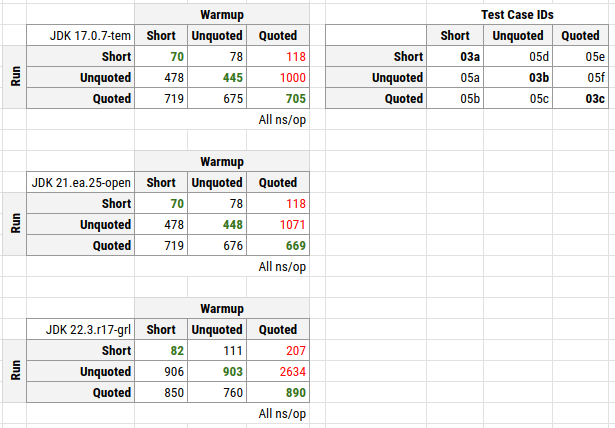
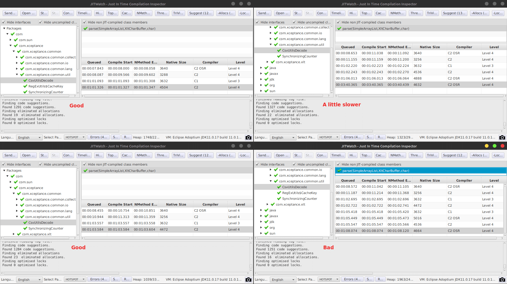
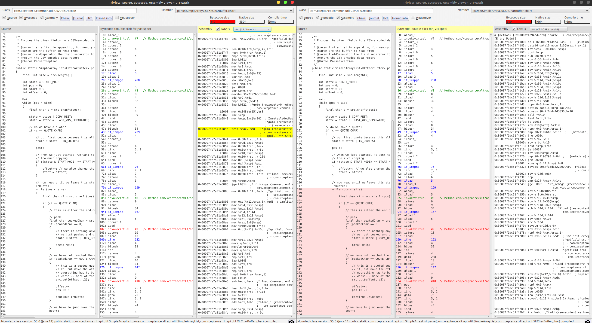
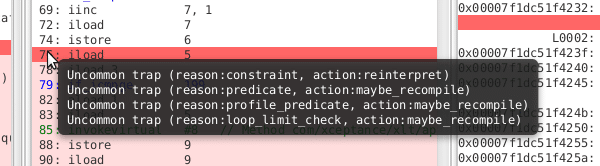
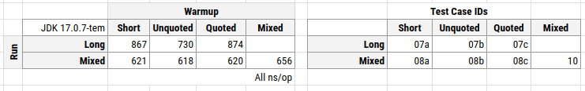

= The Curious Case of Different Runtimes
René Schwietzke
:jbake-date: 2025-02-06
:jbake-last_updated: 2025-02-06
:jbake-type: post
:jbake-status: published
:jbake-tags: Java, performance, JIT
:subheadline: Is it 5 min or 14 min?
:_excerpt: While running some final tests, we noticed extremely erratic runtime behavior. It was hard to reproduce but very annoying because it means that the application runtime goes up from 5 to almost 14 min. This article tries to show how we diagnosed it and condensed it down to a few test cases. These might hopefully help us to provide some answers. Maybe, but only maybe, we discovered a defect or at least strange edge-case in the JVM.
:pinned: true
:showfull: false
#:alias: java-the-curious-case-of-different-runtimes
:idprefix: java-the-curious-case-of-different-runtimes

While running final tests, we noticed extremely erratic runtime behavior.  This was difficult to reproduce, but very frustrating because it meant the application runtime increased from 5 to almost 14 minutes. This article describes how we diagnosed the issue and distilled it down to a few test cases. These might help us find some answers. Perhaps we've discovered a defect or at least a strange edge case in the JVM.

When our Java code processes certain data first, it compiles machine code that contains many uncommon trap markers, which seem to affect runtime behavior (this is just an observation, not a firm conclusion). When different data is processed later, the JIT compiler sticks with its initial compilation, and the runtime suffers by a factor of 2 to 5. If we change the order of the data, the runtime behavior improves dramatically, and even the data that previously led to the potentially poor code now runs fine.

We can change the code to mitigate the problem, but we are still interested in understanding why Java’s JIT compiler reaches its conclusions and persists with them. The code in question is compatible with almost any Java version and doesn't use any advanced features.

== The Problem
A few months ago, we updated our load test software, https://www.xceptance.com/xlt/[XLT] and focused on improving the report generator's runtime. While testing it before the release, we noticed very unstable runtimes. With a fixed data set, we observed runtimes between 5 and 14 minutes. The 5-minute runtime is the expected value, while longer runtimes occur only occasionally. These range from 6 to 14 minutes in about 10 to 15% of the cases.

The report generator is multi-threaded and reads approximately 7 GB of compressed CSV data (56 GB uncompressed), totaling 722,176,188 lines. Because of the multi-threaded model, the processing order is always slightly different.

*Disclaimer:* I am not a JDK/JVM/JIT expert. Everything below is based on knowledge shared by others or gained through experimentation. Your feedback is highly appreciated.

The full source code of the examples is available on https://github.com/Xceptance/XLT[GitHub].

== Summary for the Impatient
When our Java code initially encounters specific data, the compiler generates machine code containing numerous uncommon trap markers. These markers appear to influence runtime behavior, though this is currently just an observation, not a confirmed conclusion.  Subsequently, when the compiler processes different data, it seems to retain its initial code generation strategy, resulting in a significant runtime performance degradation—by a factor of 2 to 5.  However, altering the order of the data presented to the compiler dramatically improves runtime performance.  Even the data that previously led to the potentially inefficient code now executes smoothly.

The following table summarizes the runtimes observed during training (warmup) and execution (measurement) using various CSV line examples (detailed below).  We categorized the CSV lines into three types: short lines, long unquoted lines, and long lines with a quoted section. The performance difference arises because the inner loop sometimes cannot complete regularly.  This occurs when the code needs to skip over characters, forcing a `continue outerloop` statement to break the loop.

.Compared Tests Runs

The columns in the table represent the data used for the initial warm-up phase, while the rows represent the data used for the subsequent measurement phase (the "run").  The green numbers indicate expected performance, as these tests used identical data for both warm-up and measurement. The red numbers highlight unexpected performance outliers.

Running these tests with GraalVM 22.3-19 yields even worse runtimes, reaching 2,600 ns/op compared to the 1,000 ns/op observed with OpenJDK 17.  The reason for this performance degradation with GraalVM is unclear, especially considering the different JIT compilation strategies employed. However, it's possible that both JIT compilers, despite their differences, might be susceptible to similar underlying issues.

== First Diagnostics
=== Async Profiler
When we observed a process exhibiting slow performance, we used Async Profiler to capture traces. These 60-second captures clearly indicate a significant increase in time spent within the CSV parser.

==== Good
[source]
----
         ns  percent  samples  top
 ----------  -------  -------  ---
45612243950    9.55%     4559  com.xceptance.common.util.CsvUtilsDecode.parse
31634884015    6.62%     3162  itable stub
25989872875    5.44%     2589  /usr/lib/x86_64-linux-gnu/libz.so.1.2.11
23561485986    4.93%     2355  java.util.regex.Pattern$Slice.match
21140760305    4.42%     2113  vtable stub
20569614899    4.30%     2056  java.util.regex.Pattern$BmpCharProperty.match
19321839309    4.04%     1931  jdk.internal.util.ArraysSupport.mismatch
18011700149    3.77%     1800  com.xceptance.xlt.api.util.XltCharBuffer.hashCode
----

==== Bad
[source]
----
          ns  percent  samples  top
  ----------  -------  -------  ---
384925806756   79.68%    38490  com.xceptance.common.util.CsvUtilsDecode.parse
  5582345351    1.16%      558  com.xceptance.xlt.api.util.XltCharBuffer.hashCode
  5393452865    1.12%      537  /usr/lib/x86_64-linux-gnu/libz.so.1.2.11
  5132247709    1.06%      513  itable stub
  4932415970    1.02%      493  java.util.regex.Pattern$Slice.match
  4400943650    0.91%      440  com.xceptance.xlt.api.util.XltCharBuffer.viewFromTo
  4381854811    0.91%      438  java.util.regex.Pattern$BmpCharProperty.match
  3881428022    0.80%      388  vtable stub
----

=== PrintCompilation
Because it seems that the compiled code differs occasionally, we looked at the compilation for that very method. This screenshot shows four different captures (displayed using https://github.com/AdoptOpenJDK/jitwatch[JITWatch]).

.JITWatch in Action

A pattern appears to be associated with the observed slowness: the C2 On-Stack Replacement (OSR) compiler was the last to compile the affected code.  In all other cases, performance remained good.  Furthermore, even upon examining the compiled code, it's clear that the size of the compiled output varies significantly. This suggests that the data presented to the JIT compiler heavily influences its optimization decisions.

Consequently, we conducted a more detailed inspection of the resulting compiled code using JITWatch.

.JITWatch C2-Assembler Output

JITWatch highlighted a specific code section in red, indicating that it contained four additional uncommon traps.  The corresponding well-performing code version did not contain any of these traps.

.Red Area with Uncommon Trap Warning

We have identified the presence of additional uncommon traps in the slower code path through profiling and compiler analysis. However, the underlying cause and a reliable method for reproducing this behavior remain unknown.

== Theory
Based on our observations, profiling results, and knowledge of the data processed by the parser, we have formulated the following theory:

When the parser encounters specific CSV line lengths or content early in the process, it generates a poorly optimized compiled version of the code.  The compiler then appears to retain this suboptimal compilation decision, leading to persistently poor performance.  Because CSV processing is multi-threaded, the order of CSV lines is non-deterministic.  Since this performance issue only occurs in 10 to 15% of cases, the data that triggers it must also be relatively infrequent.

Our next step is to identify simple test cases that precisely replicate the behavior observed under load. This will enable us to better understand the underlying problem, potentially allowing us to submit a bug report or share our findings as a learning experience.

To achieve this, we will examine the extreme cases within our data and attempt to construct representative test cases.

== Data
For this test, we are using three CSV data lines.  The long versions are abbreviated here for clarity, with the full versions available in the source code.

* SHORT: `T,TFlashCheckout,1666958662310,17729,false,,,,`
* LONG Unquoted: `R,CandleDaySalesPage.2,1666954266805,95,false,1349,429,200,https://,image/gif,0,0,95,0,95,95,,GET,,,0,,`
* LONG Quoted: `R,CandleDaySalesPage.2,1666954266805,95,false,1349,429,200,"https://",image/gif,0,0,95,0,95,95,,GET,,,0,,`

As you can see, the long version differs from the short version only in the presence of additional quotes around the URL, which may contain commas. The parsing logic handles these quotes by removing them inline during the parsing process.  The entire parsing mechanism is optimized for minimal to no memory allocation, as we need to parse millions of these lines. This optimization is also why we avoid using String parsing directly and instead work with a custom char array, which provides views into the underlying array rather than creating copies of the data.

The quoted version, containing commas within URLs, is infrequent due to the relatively low occurrence of commas in URLs.

== Test Case
Our test case employs JMH and uses a technique to utilize different data during the warm-up phase. We track the number of setup executions and compare it against the provided BenchmarkParams. Once the measurement phase begins, we switch to a different dataset.  While there might be alternative approaches, I haven't found a JMH API that directly exposes the test state.

The standard test cases utilize a single character array (as the parser prefers open, writable arrays over Strings) and run the benchmark against that data.  These are represented by the B03 test cases. The advanced test case, which requires different warm-up and measurement data, maintains state counters and calls the setup method for each invocation. These are represented by the B05 test cases.

== Measurements and Results
All measurements have been taken on a Google Cloud c2-standard-8 instance. Similar data has been seen on a Lenovo T14s AMD.

.Compared Tests Runs

We compiled additional test cases to vary the data a little more.

* B07 - Train with single line data, measure the long lines only
* B08 - Train with single line data, measure with all line types
* B10 - Train with all, measure with all

.Test Case IDs and Runtimes

While the differences aren't as pronounced as in the single runs, this can be attributed to the averaging effect of processing multiple data lines. Training with short, quoted lines results in a larger runtime difference when subsequently running only long data. However, when using mixed execution and mixed training data, these differences become negligible.

== Conclusion
We have created a test case demonstrating that the JIT compiler generates different code depending on whether the data presented during initial compilation differs from the data subsequently processed at runtime. This behavior is not unexpected; it's a known characteristic of C2 optimization, which profiles running code to identify the most efficient version.

The surprising aspects are twofold: first, the magnitude of the performance difference between these versions; and second, the JVM's apparent inability to switch away from the slower, suboptimal version, even after extended runtime (e.g., 10 minutes or more).

This behavior might be intentional, and perhaps there's nothing we can do except modify our Java code to avoid triggering it. While changing our code is an option, the observed JIT behavior could represent a more general, albeit rare, issue.  It is certainly a difficult problem to diagnose and could lead to significant debugging challenges.
